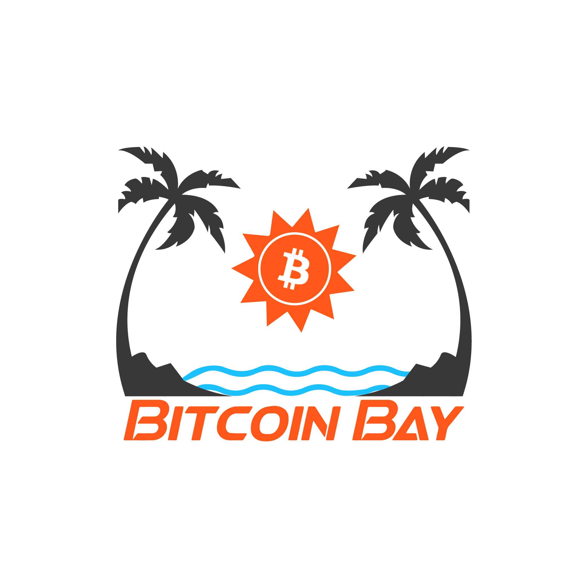

# Bay Wallet

ldk wallet & nostr client for the plebs of tampa, by tampa plebs.



## Description

Bay Wallet is a project spawned from the Tampa BitDevs meetup. The goal of the project is to inspire new Bitcoin developers to work on a Bitcoin project in a collaborative environment with experienced Bitcoin developers.

Bay Wallet is built with LDK, a Lightning implementation library. LDK allows developers to create full node implementations wihtout having to use a monolithic node implementation such as LND, Core Lightning, or Eclair. This bodes well for mobile because we can run a full node on the device.

Included with Bay Wallet is a nostr client. Having a nostr client included with a Lightning wallet creates a seamless UX for zaps, community engagement, as well as app support.

***Resources***
* [LDK (rust-lightning)](https://github.com/lightningdevkit/rust-lightning)
* [LDK Project Website](https://lightningdevkit.org/)
* [React-Native LDK by Synonym](https://github.com/synonymdev/react-native-ldk)

## Install Instructions

Download the code base and install dependencies.
```
git clone https://github.com/bennyhodl/baywallet.git
cd baywallet
yarn install
```

Setup react-native for your operating system.
```
yarn rn-setup
```

## Setup local Bitcoin Environment
*** Bay Wallet has a default electrum environment. If you want to test electrum locally, follow below***
Developers must be running a Bitcoin node with `electrs` to be able to get block information. This repositroy has a docker configuration for developers to setup an environment easily. [Docker has to be installed](https://www.docker.com/) to be able to run the developer environment.

```
docker-compose up -d --build
```

This command spins up a `bitcoind` instance in regtest as well as `electrs` to expose an RPC for block data, transaction information, and account information for LDK to use.

After running the docker configuration, run these commands to get fully setup to use Bay Wallet.

```
# Create a wallet on the `bitcoind` node to use.
yarn bc:create-wallet

# If you have started the node before, run this to load the wallet.
yarn bc:load-wallet

# Generate blocks on the node.
yarn bc:generate <num-blocks>
```

After starting the Bitcoin node, creating a wallet, and generating a full block, the `electrs` REST API will be available. You can then start the application:
```
// iOS
yarn ios

// Android
// yarn android
```

Bay Wallet uses the `electrs` library to query the chain. To explore the API, the docs can be found [here.](https://github.com/Blockstream/esplora/blob/master/API.md)
